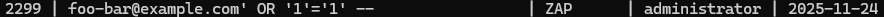
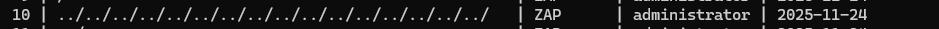
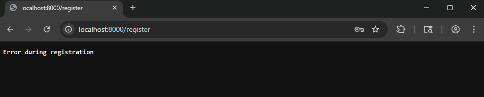

# 1️⃣ Introduction

**Tester(s):**  
- Name:  Ville Salmi

**Purpose:**  
- Purpose of this test was to find vulnerabilities from http://localhost:8000

**Scope:**  
- Tested components: http://localhost:8000
  - /register
  - /static/index.js
- Exclusions:  -
- Test approach:White-box

**Test environment & dates:**  
- Start:  19:00 24.11.2025
- End:  22:00 24.11.2025
- Test environment details (OS, runtime, DB, browsers):
  - Operating system: Windows 11
  - Runtime: About 3 hours
  - Database: PostgreSQL
  - Browsers: Google Chrome

**Assumptions & constraints:**  
- It was known that the application contains vulnerabilities such as SQL injection and the test was expected to verify and identify the issues

# 2️⃣ Executive Summary

**Short summary (1-2 sentences):**
- Security test revealed 2 high risk vulnerabilities, 4 medium risk vulnerabilities and 1 low risk vulnerabilities

**Overall risk level:** (Low / Medium / High / Critical)

**Top 5 immediate actions:**  
1.  Path Traversal (High)
2.  SQL injection (High)
3.  Absence of anti-CSRF tokens (Medium)
4.  Content Security policy header not set (Medium)
5.  Format String Error (Medium)

---

# 3️⃣ Severity scale & definitions

|  **Severity Level**  | **Description**                                                                                                              | **Recommended Action**           |
| -------------------- | ---------------------------------------------------------------------------------------------------------------------------- | -------------------------------- |
|      🔴 **High**     | A serious vulnerability that can lead to full system compromise or data breach (e.g., SQL Injection, Remote Code Execution). | *Immediate fix required*         |
|     🟠 **Medium**    | A significant issue that may require specific conditions or user interaction (e.g., XSS, CSRF).                              | *Fix ASAP*                       |
|      🟡 **Low**      | A minor issue or configuration weakness (e.g., server version disclosure).                                                   | *Fix soon*                       |
| 🔵 **Info** | No direct risk, but useful for system hardening (e.g., missing security headers).                                            | *Monitor and fix in maintenance* |

---

# 4️⃣ Findings (filled with examples → replace)

> Fill in one row per finding. Focus on clarity and the most important issues.

| ID | Severity | Finding | Description | Evidence / Proof |
|------|-----------|----------|--------------|------------------|
| F-01 | 🔴 High | SQL Injection in registration | Input field allows `' OR '1'='1` injection |  |
| F-02 | 🔴 High | Path traversal | Input field allows ../../../../ |  |
| F-03 | 🟠 Medium | Format String Error | Application crashes if you put !"# for password |  |
| F-04 | 🟡 Low | Weak password policy | Accepts passwords like "12345" |  |
| F-05 | 🟡 Low | Age verification | Application isnt verifying age at all |  |

---

> [!NOTE]
> Include up to 5 findings total.   
> Keep each description short and clear.

---

# 5️⃣ OWASP ZAP Test Report (Attachment)

https://github.com/Rinezki/CybersecurityAndDataPrivacyAutumn2025/blob/main/BookingSystem/part1/Zap_report_round1.md