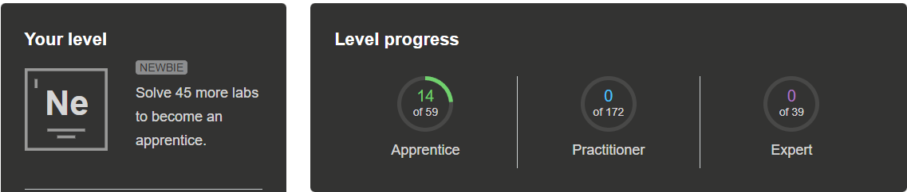

# Viimeinen raportti

## portswigger

- Tässä portswigger dashboard:

- Lista labeista mitä tein:
- SQL injection vulnerability: in WHERE clause allowing retrieval of hidden data, SQL injection vulnerability allowing login bypass
- Cross-site scripting: Reflected XSS into HTML context with nothing encoded, Stored XSS into HTML context with nothing encoded, DOM XSS in document.write sink using source location.search, DOM XSS in innerHTML sink using source location.search, DOM XSS in jQuery anchor href attribute sink using location.search source
- Path traversal: File path traversal, simple case
- Access control: Unprotected admin functionality, User role can be modified in user profile
- Authentication: Username enumeration via different responses, Password reset broken logic
- Business logic vulnerabilities: Excessive trust in client-side controls, High-level logic vulnerability

## Booking system projekti

- Phase 1: tässä taskissa käytin ensimmäistä kertaa zappia. Zappi testin jälkeen löysin tietokannasta sql injektioon viittaavia käyttäjiä, path traversal käyttäjiä ja testasin itse sivulta minkälaisia salasanoja sivu hyväksyy ja totesin, että melkein mitä vaan. Tein tästä raportin ja se oli aikalailla siinä. Eniten aikaa kului raportin kirjoittamiseen. Part 2 tässä phasessa kävi semmonen vahinko, että en ihan ymmärtänyt tehtävän antoa ja laitoin githubiin minun repolle kommentoinnin auki ja sinne kirjoitin kommenttini.
- Phase 2: tehtävässä piti murtaa hashattuja salasanoja ja tämä tehtävä oli minusta tosi mielenkiintoinen. Tässä tehtävässä minulla meni aika paljon ekstra aikaa kali linuxin asentamiseen virtual boxiin ja kohtuullisen kauan meni saada kiinni miten hashcatti toimii, mutta sitten kun sain hommasta kiinni niin se oli tosi mukavaa.
- Phase 3: tämä tehtävä oli mielestäni mukavan haastava, kun piti aika paljonkin improvisoida. Seurasin videolta kuinka käyttää gobusteria sain siitä mielestäni kohtuullisen hyvin kiinni. Improvisaatio osa tehtävässä oli kun jos muistan oikein videolla oli vm serveri, jossa pyöri nettisivut, mutta omalla koneella pyöritin lokaalina. Meni aika paljon aikaa selvittää millä ip:llä saan yhteyden windowsissa lokaalina pyörivään nettisivuun minun vm linuxista, mutta siitäkin selvittiin.

## Mitä opin kurssilla?
- kurssilla opin murtamaan hashattuja salasanoja
- miten sql injektio toimii
- miten path traversal toimii
- miten cross-site scripting toimii
- mitä heikkouksia voi olla access controllissa
- mitä heikkouksia voi olla authenticationissa
- mitä heikkouksia voi ilmetä jos serveri luottaa liikaa clientin vastauksiin.
- Opin myös käyttämään zappia ja tekemään sillä raportteja testeistä
- Opin löytämään gobusterilla sivuista apeja
- Opin käyttämään burppia
- ja kurssin tutustutti minut port swiggeriin ja saatan kyllä tehdä kurssin jälkeenkin port swigger tehtäviä niitä oli mukava tehdä

## Kurssilla käytetyt tunnit

- Tunnit yhteensä: 42h + 3h (jos loppuraportin kirjoittaminen lasketaan kanssa)
- netacademy tunnit: 10h
- Port swigger tehtävät: 12h
- Booking system projekti tunnit: 20h
- Viimeinen raportti: 3h